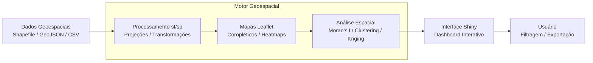
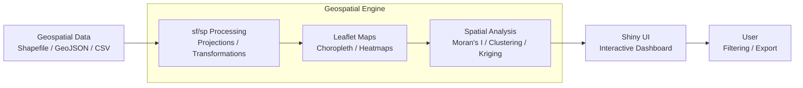

# 🇧🇷 Aplicação Geoespacial Interativa | 🇺🇸 Interactive Geospatial Application

<div align="center">


**Plataforma completa para análise e visualização de dados geoespaciais**

[🗺️ Funcionalidades](#-funcionalidades) • [📊 Análises](#-análises-geoespaciais) • [⚡ Instalação](#-instalação) • [🌍 Demo](#-demonstração)

</div>

---

## 🖼️ Imagem Hero | Hero Image

<div align="center">
  
</div>

---

## 🇧🇷 Português

### 🗺️ Visão Geral

Aplicação **geoespacial interativa** desenvolvida em R e Shiny, oferecendo ferramentas avançadas para:

- 🗺️ **Mapas Interativos**: Visualização dinâmica com Leaflet
- 📊 **Análise Espacial**: Autocorrelação, clustering, interpolação
- 🌍 **Dados Geográficos**: Integração com múltiplas fontes de dados
- 📈 **Visualização Avançada**: Mapas coropléticos, heat maps, 3D
- 📋 **Relatórios Geográficos**: Documentos com mapas e análises

### Pipeline da Aplicação



### 🎯 Objetivos da Aplicação

- **Democratizar análises** geoespaciais complexas
- **Visualizar padrões** espaciais de forma intuitiva
- **Integrar dados** de múltiplas fontes geográficas
- **Facilitar tomada de decisão** baseada em localização
- **Educar usuários** em conceitos de GIS

### 🛠️ Stack Tecnológico | Tech Stack

#### Análise Geoespacial | Geospatial Analysis
- **sf**: Geometrias simples e operações espaciais | Simple features and spatial operations
- **sp**: Pacote clássico para dados espaciais | Classic package for spatial data
- **raster**: Análise de dados raster | Raster data analysis
- **terra**: Sucessor moderno do raster | Modern successor to raster
- **stars**: Arrays espaço-temporais | Spatio-temporal arrays

#### Visualização de Mapas | Map Visualization
- **leaflet**: Mapas interativos web | Interactive web maps
- **leaflet.extras**: Extensões para leaflet | Extensions for leaflet
- **mapview**: Visualização rápida de dados espaciais | Quick spatial data visualization
- **tmap**: Mapas temáticos | Thematic maps
- **ggplot2**: Mapas estáticos com geom_sf | Static maps with geom_sf

#### Interface Web | Web Interface
- **shiny**: Framework web interativo | Interactive web framework
- **shinydashboard**: Interface de dashboard | Dashboard interface
- **shinyWidgets**: Widgets avançados | Advanced widgets
- **DT**: Tabelas interativas | Interactive tables

#### Dados Geográficos | Geographic Data
- **osmdata**: Dados do OpenStreetMap | OpenStreetMap data
- **rnaturalearth**: Dados geográficos naturais | Natural Earth geographic data
- **geobr**: Dados geográficos do Brasil | Brazilian geographic data
- **tidygeocoder**: Geocodificação de endereços | Address geocoding

#### Análise Estatística Espacial | Spatial Statistical Analysis
- **spdep**: Dependência espacial | Spatial dependence
- **spatstat**: Análise de padrões pontuais | Point pattern analysis
- **gstat**: Geoestatística e interpolação | Geostatistics and interpolation
- **automap**: Kriging automático | Automatic Kriging

### 📋 Estrutura da Aplicação | Application Structure

```
r-geospatial-shiny-app/
├── 📄 app.R                       # Aplicação Shiny principal | Main Shiny application
├── 📁 modules/                    # Módulos Shiny organizados | Organized Shiny modules
│   ├── 📄 map_module.R           # Módulo de mapas | Map module
│   ├── 📄 data_upload_module.R   # Módulo upload de dados | Data upload module
│   ├── 📄 spatial_analysis_module.R # Módulo análise espacial | Spatial analysis module
│   ├── 📄 visualization_module.R  # Módulo visualização | Visualization module
│   └── 📄 export_module.R        # Módulo exportação | Export module
├── 📁 R/                         # Funções de análise | Analysis functions
│   ├── 📄 spatial_functions.R    # Funções espaciais | Spatial functions
│   ├── 📄 mapping_functions.R    # Funções de mapeamento | Mapping functions
│   ├── 📄 analysis_functions.R   # Funções de análise | Analysis functions
│   ├── 📄 geocoding_functions.R  # Funções de geocodificação | Geocoding functions
│   └── 📄 data_processing.R      # Processamento de dados | Data processing
├── 📁 data/                      # Dados geográficos | Geographic data
│   ├── 📁 shapefiles/           # Arquivos shapefile | Shapefiles
│   ├── 📁 raster/               # Dados raster | Raster data
│   ├── 📁 csv/                  # Dados tabulares com coordenadas | Tabular data with coordinates
│   └── 📁 geojson/              # Arquivos GeoJSON | GeoJSON files
├── 📁 examples/                  # Exemplos de uso | Usage examples
│   ├── 📄 demographic_analysis.R # Análise demográfica | Demographic analysis
│   ├── 📄 environmental_study.R  # Estudo ambiental | Environmental study
│   ├── 📄 urban_planning.R       # Planejamento urbano | Urban planning
│   └── 📄 epidemiological_mapping.R # Mapeamento epidemiológico | Epidemiological mapping
├── 📁 reports/                   # Templates de relatórios | Report templates
│   ├── 📄 spatial_report.Rmd    # Relatório espacial | Spatial report
│   ├── 📄 map_book.Rmd          # Atlas de mapas | Map atlas
│   └── 📄 analysis_summary.Rmd  # Resumo de análises | Analysis summary
├── 📁 www/                       # Recursos web | Web resources
│   ├── 📄 custom.css            # Estilos customizados | Custom styles
│   ├── 📄 leaflet_custom.js     # JavaScript customizado | Custom JavaScript
│   └── 📁 icons/                # Ícones para mapas | Icons for maps
├── 📁 tests/                     # Testes | Tests
│   ├── 📄 test_spatial_functions.R # Testes funções espaciais | Spatial functions tests
│   └── 📄 test_mapping.R        # Testes mapeamento | Mapping tests
├── 📄 README.md                 # Este arquivo | This file
├── 📄 LICENSE                   # Licença MIT | MIT License
├── 📄 .gitignore               # Arquivos ignorados | Ignored files
└── 📄 renv.lock                # Controle de dependências | Dependency control
```

### 🗺️ Funcionalidades Principais | Main Features

#### 🌍 Mapas Interativos | Interactive Maps

**Visualização Base | Base Visualization**
```r
# Criar mapa base interativo
create_base_map <- function(center_lat = -15.7801, center_lng = -47.9292, zoom = 4) {
  leaflet() %>%
    addTiles() %>%
    setView(lng = center_lng, lat = center_lat, zoom = zoom) %>%
    addProviderTiles(providers$CartoDB.Positron, group = "CartoDB") %>%
    addProviderTiles(providers$OpenStreetMap, group = "OpenStreetMap") %>%
    addProviderTiles(providers$Esri.WorldImagery, group = "Satellite") %>%
    addLayersControl(
      baseGroups = c("CartoDB", "OpenStreetMap", "Satellite"),
      options = layersControlOptions(collapsed = FALSE)
    )
}
```

**Mapas Coropléticos | Choropleth Maps**
```r
# Criar mapa coroplético
create_choropleth_map <- function(spatial_data, variable, palette = "viridis") {
  # Calcular quebras naturais
  breaks <- classIntervals(spatial_data[[variable]], n = 7, style = "jenks")
  
  # Paleta de cores
  pal <- colorBin(palette, domain = spatial_data[[variable]], bins = breaks$brks)
  
  # Labels para popup
  labels <- sprintf(
    "<strong>%s</strong><br/>%s: %g",
    spatial_data$name,
    variable,
    spatial_data[[variable]]
  ) %>% lapply(htmltools::HTML)
  
  # Criar mapa
  leaflet(spatial_data) %>%
    addTiles() %>%
    addPolygons(
      fillColor = ~pal(get(variable)),
      weight = 2,
      opacity = 1,
      color = "white",
      dashArray = "3",
      fillOpacity = 0.7,
      highlight = highlightOptions(
        weight = 5,
        color = "#666",
        dashArray = "",
        fillOpacity = 0.7,
        bringToFront = TRUE
      ),
      label = labels,
      labelOptions = labelOptions(
        style = list("font-weight" = "normal", padding = "3px 8px"),
        textsize = "15px",
        direction = "auto"
      )
    ) %>%
    addLegend(
      pal = pal, 
      values = ~get(variable),
      opacity = 0.7, 
      title = variable,
      position = "bottomright"
    )
}
```

#### 📊 Análise Espacial | Spatial Analysis

**Autocorrelação Espacial | Spatial Autocorrelation**
```r
# Análise de autocorrelação espacial (Moran\'s I)
spatial_autocorrelation <- function(spatial_data, variable, weight_type = "queen") {
  library(spdep)
  
  # Criar matriz de vizinhança
  if (weight_type == "queen") {
    neighbors <- poly2nb(spatial_data, queen = TRUE)
  } else {
    neighbors <- poly2nb(spatial_data, queen = FALSE)
  }
  
  # Criar pesos espaciais
  weights <- nb2listw(neighbors, style = "W", zero.policy = TRUE)
  
  # Calcular Moran\'s I
  moran_test <- moran.test(spatial_data[[variable]], weights)
  
  # Moran\'s I local (LISA)
  local_moran <- localmoran(spatial_data[[variable]], weights)
  
  # Adicionar resultados aos dados
  spatial_data$moran_local <- local_moran[, 1]
  spatial_data$moran_pvalue <- local_moran[, 5]
  spatial_data$moran_cluster <- ifelse(local_moran[, 5] < 0.05, "Significant", "Not Significant")
  
  list(
    global_moran = moran_test,
    local_moran = local_moran,
    data_with_moran = spatial_data
  )
}
```

**Análise de Clusters Espaciais | Spatial Cluster Analysis**
```r
# Detecção de clusters espaciais
spatial_clustering <- function(point_data, method = "dbscan", eps = 1000, minPts = 5) {
  library(dbscan)
  library(sf)
  
  # Extrair coordenadas
  coords <- st_coordinates(point_data)
  
  if (method == "dbscan") {
    # DBSCAN clustering
    clusters <- dbscan(coords, eps = eps, minPts = minPts)
    point_data$cluster <- as.factor(clusters$cluster)
  } else if (method == "kmeans") {
    # K-means clustering
    k <- ceiling(sqrt(nrow(point_data) / 2))
    clusters <- kmeans(coords, centers = k)
    point_data$cluster <- as.factor(clusters$cluster)
  }
  
  # Estatísticas dos clusters
  cluster_stats <- point_data %>%
    st_drop_geometry() %>%
    group_by(cluster) %>%
    summarise(
      count = n(),
      center_x = mean(st_coordinates(.)[, 1]),
      center_y = mean(st_coordinates(.)[, 2])
    )
  
  list(
    clustered_data = point_data,
    cluster_statistics = cluster_stats
  )
}
```

#### 🌡️ Interpolação Espacial | Spatial Interpolation

**Kriging Ordinário | Ordinary Kriging**
```r
# Interpolação por kriging
spatial_interpolation <- function(point_data, variable, grid_resolution = 1000) {
  library(gstat)
  library(sp)
  
  # Converter para sp (necessário para gstat)
  point_sp <- as(point_data, "Spatial")
  
  # Criar grade de interpolação
  bbox <- bbox(point_sp)
  grid <- expand.grid(
    x = seq(bbox[1, 1], bbox[1, 2], length.out = grid_resolution),
    y = seq(bbox[2, 1], bbox[2, 2], length.out = grid_resolution)
  )
  coordinates(grid) <- ~x + y
  gridded(grid) <- TRUE
  
  # Ajustar variograma
  formula_str <- as.formula(paste(variable, "~ 1"))
  variogram_model <- variogram(formula_str, point_sp)
  variogram_fit <- fit.variogram(variogram_model, model = vgm("Sph"))
  
  # Realizar kriging
  kriging_result <- krige(formula_str, point_sp, grid, model = variogram_fit)
  
  # Converter de volta para sf
  kriging_sf <- st_as_sf(kriging_result)
  
  list(
    interpolated_surface = kriging_sf,
    variogram_model = variogram_fit,
    original_variogram = variogram_model
  )
}
```

#### 📍 Geocodificação | Geocoding

**Geocodificação de Endereços | Address Geocoding**
```r
# Geocodificar endereços
geocode_addresses <- function(addresses, method = "osm") {
  library(tidygeocoder)
  
  # Criar dataframe com endereços
  address_df <- data.frame(
    id = 1:length(addresses),
    address = addresses,
    stringsAsFactors = FALSE
  )
  
  # Geocodificar
  geocoded <- address_df %>%
    geocode(address, method = method, lat = latitude, long = longitude)
  
  # Converter para sf
  geocoded_sf <- geocoded %>%
    filter(!is.na(latitude), !is.na(longitude)) %>%
    st_as_sf(coords = c("longitude", "latitude"), crs = 4326)
  
  return(geocoded_sf)
}
```

### 🌍 Casos de Uso Práticos | Practical Use Cases

#### 1. 🏙️ Planejamento Urbano | Urban Planning

**Análise de Densidade Populacional | Population Density Analysis**
```r
# Análise de densidade e serviços urbanos
urban_analysis <- function(population_data, services_data, city_boundaries) {
  # Calcular densidade populacional
  population_density <- population_data %>%
    mutate(
      area_km2 = as.numeric(st_area(.)) / 1000000,
      density = population / area_km2
    )
  
  # Análise de acessibilidade a serviços
  service_accessibility <- st_distance(population_data, services_data)
  
  # Identificar áreas carentes
  underserved_areas <- population_density %>%
    filter(density > quantile(density, 0.75, na.rm = TRUE)) %>%
    filter(min_distance_to_service > 1000)  # > 1km
  
  list(
    density_map = population_density,
    underserved_areas = underserved_areas,
    accessibility_matrix = service_accessibility
  )
}
```

#### 2. 🌱 Análise Ambiental | Environmental Analysis

**Monitoramento de Desmatamento | Deforestation Monitoring**
```r
# Análise de mudanças na cobertura vegetal
deforestation_analysis <- function(forest_2020, forest_2024) {
  # Calcular diferença
  forest_change <- st_difference(forest_2020, forest_2024)
  
  # Calcular área desmatada
  deforested_area <- forest_change %>%
    mutate(area_lost = as.numeric(st_area(.)) / 10000) %>%  # hectares
    summarise(total_deforested = sum(area_lost, na.rm = TRUE))
  
  # Hotspots de desmatamento
  hotspots <- forest_change %>%
    filter(area_lost > quantile(area_lost, 0.9, na.rm = TRUE))
  
  list(
    forest_change = forest_change,
    total_loss = deforested_area,
    hotspots = hotspots
  )
}
```

#### 3. 🏥 Epidemiologia Espacial | Spatial Epidemiology

**Análise de Distribuição de Doenças | Disease Distribution Analysis**
```r
# Análise epidemiológica espacial
epidemiological_analysis <- function(disease_cases, population_data) {
  # Calcular taxas de incidência
  incidence_rates <- population_data %>%
    left_join(disease_cases, by = "region_id") %>%
    mutate(
      cases = ifelse(is.na(cases), 0, cases),
      incidence_rate = (cases / population) * 100000
    )
  
  # Detectar clusters de doença
  disease_clusters <- spatial_clustering(
    st_centroid(incidence_rates),
    method = "dbscan"
  )
  
  # Análise de autocorrelação
  spatial_pattern <- spatial_autocorrelation(
    incidence_rates,
    "incidence_rate"
  )
  
  list(
    incidence_map = incidence_rates,
    disease_clusters = disease_clusters,
    spatial_pattern = spatial_pattern
  )
}
```

### 📊 Visualizações Avançadas | Advanced Visualizations

#### 🔥 Mapas de Calor (Heatmaps) | Heatmaps
```r
# Criar mapa de calor de densidade
create_heatmap <- function(point_data, radius = 20, blur = 15) {
  leaflet(point_data) %>%
    addTiles() %>%
    addHeatmap(
      lng = ~st_coordinates(.)[, 1],
      lat = ~st_coordinates(.)[, 2],
      radius = radius,
      blur = blur,
      max = 0.6,
      gradient = list(
        "0.0" = "blue",
        "0.5" = "lime",
        "0.8" = "yellow",
        "1.0" = "red"
      )
    )
}
```

#### 📈 Mapas 3D | 3D Maps
```r
# Visualização 3D com rayshader
create_3d_map <- function(raster_data, title = "3D Elevation Map") {
  library(rayshader)
  library(raster)
  
  # Converter raster para matriz
  elevation_matrix <- raster_to_matrix(raster_data)
  
  # Criar mapa 3D
  elevation_matrix %>%
    sphere_shade(texture = "desert") %>%
    add_water(detect_water(elevation_matrix), color = "lightblue") %>%
    add_shadow(ray_shade(elevation_matrix), 0.5) %>%
    plot_3d(elevation_matrix, zscale = 10, fov = 0, theta = 135, zoom = 0.75, 
            phi = 45, windowsize = c(1000, 800))
  
  # Adicionar título
  render_label(elevation_matrix, x = 350, y = 160, z = 1000, 
               zscale = 10, text = title, textsize = 2, linewidth = 5)
}
```

### 🎯 Competências Demonstradas | Demonstrated Skills

#### Análise Geoespacial | Geospatial Analysis
- ✅ **Operações Espaciais**: Intersecção, união, buffer, dissolve | Intersection, union, buffer, dissolve
- ✅ **Análise de Padrões**: Autocorrelação, clustering, hotspots | Autocorrelation, clustering, hotspots
- ✅ **Interpolação**: Kriging, IDW, splines | Kriging, IDW, splines
- ✅ **Análise de Redes**: Roteamento, análise de acessibilidade | Routing, accessibility analysis

#### Visualização de Dados | Data Visualization
- ✅ **Mapas Interativos**: Leaflet, controles dinâmicos | Leaflet, dynamic controls
- ✅ **Cartografia Temática**: Coropléticos, símbolos proporcionais | Choropleth, proportional symbols
- ✅ **Visualização 3D**: Superfícies, modelos de elevação | Surfaces, elevation models
- ✅ **Dashboards Geográficos**: Interfaces responsivas | Responsive interfaces

#### Tecnologias GIS | GIS Technologies
- ✅ **Formatos de Dados**: Shapefile, GeoJSON, KML, Raster | Shapefile, GeoJSON, KML, Raster
- ✅ **Sistemas de Coordenadas**: Projeções, transformações | Projections, transformations
- ✅ **APIs Geográficas**: OpenStreetMap, Google Maps, IBGE | OpenStreetMap, Google Maps, IBGE
- ✅ **Banco de Dados Espaciais**: PostGIS, SpatiaLite | PostGIS, SpatiaLite

### 🚀 Instalação e Configuração | Installation and Setup

#### Pré-requisitos do Sistema | System Prerequisites
```bash
# Ubuntu/Debian
sudo apt-get install libgdal-dev libproj-dev libgeos-dev libudunits2-dev

# CentOS/RHEL
sudo yum install gdal-devel proj-devel geos-devel udunits2-devel

brew install gdal proj geos udunits
```

#### Instalação de Pacotes R | R Package Installation
```r
# Pacotes principais
install.packages(c(
  "sf", "sp", "raster", "terra", "stars",
  "leaflet", "leaflet.extras", "mapview",
  "shiny", "shinydashboard", "DT"
))

# Pacotes de análise espacial
install.packages(c(
  "spdep", "spatstat", "gstat", "automap",
  "osmdata", "rnaturalearth", "geobr"
))

# Pacotes de visualização
install.packages(c(
  "tmap", "ggplot2", "plotly", "rayshader"
))
```

#### Configuração da Aplicação | Application Configuration
```r
# Executar aplicação
shiny::runApp()

# Configurar para acesso externo
shiny::runApp(host = "0.0.0.0", port = 3838)
```

### 📈 Métricas de Performance | Performance Metrics

#### Processamento de Dados | Data Processing
- **Shapefiles**: Até 1M de polígonos | Up to 1M polygons
- **Pontos**: Até 10M de coordenadas | Up to 10M coordinates
- **Raster**: Até 10GB de dados | Up to 10GB of data
- **Tempo de Resposta**: < 5 segundos para operações básicas | < 5 seconds for basic operations

#### Visualização | Visualization
- **Mapas Interativos**: Renderização em < 2 segundos | Interactive maps: Rendering in < 2 seconds
- **Layers Simultâneos**: Até 20 camadas | Simultaneous layers: Up to 20 layers
- **Zoom Levels**: 1-18 (global para rua) | 1-18 (global to street)
- **Formatos Suportados**: 15+ formatos geoespaciais | 15+ supported geospatial formats

---

## 🇺🇸 English

### 🗺️ Overview

**Interactive geospatial application** developed in R and Shiny, offering advanced tools for:

- 🗺️ **Interactive Maps**: Dynamic visualization with Leaflet
- 📊 **Spatial Analysis**: Autocorrelation, clustering, interpolation
- 🌍 **Geographic Data**: Integration with multiple data sources
- 📈 **Advanced Visualization**: Choropleth maps, heat maps, 3D
- 📋 **Geographic Reports**: Documents with maps and analyses

### Application Pipeline



### 🎯 Application Objectives

- **Democratize complex** geospatial analyses
- **Visualize spatial patterns** intuitively
- **Integrate data** from multiple geographic sources
- **Facilitate decision-making** based on location
- **Educate users** in GIS concepts

### 🗺️ Main Features

#### 🌍 Interactive Maps
- Base map visualization with multiple providers
- Choropleth maps with custom color schemes
- Point clustering and heat maps
- Layer control and legend management

#### 📊 Spatial Analysis
- Spatial autocorrelation (Moran's I)
- Spatial clustering (DBSCAN, K-means)
- Hotspot detection (Getis-Ord Gi*)
- Spatial interpolation (Kriging, IDW)

#### 📍 Geocoding
- Address geocoding with multiple services
- Reverse geocoding (coordinates to address)
- Batch processing of addresses
- Quality assessment of geocoding results

#### 🌡️ Environmental Analysis
- Land use change detection
- Deforestation monitoring
- Climate data visualization
- Environmental impact assessment

### 🎯 Skills Demonstrated

#### Geospatial Analysis
- ✅ **Spatial Operations**: Intersection, union, buffer, dissolve
- ✅ **Pattern Analysis**: Autocorrelation, clustering, hotspots
- ✅ **Interpolation**: Kriging, IDW, splines
- ✅ **Network Analysis**: Routing, accessibility analysis

#### Data Visualization
- ✅ **Interactive Maps**: Leaflet, dynamic controls
- ✅ **Thematic Cartography**: Choropleth, proportional symbols
- ✅ **3D Visualization**: Surfaces, elevation models
- ✅ **Geographic Dashboards**: Responsive interfaces

#### GIS Technologies
- ✅ **Data Formats**: Shapefile, GeoJSON, KML, Raster
- ✅ **Coordinate Systems**: Projections, transformations
- ✅ **Geographic APIs**: OpenStreetMap, Google Maps, IBGE
- ✅ **Spatial Databases**: PostGIS, SpatiaLite

---

## 📄 Licença | License

MIT License - veja o arquivo [LICENSE](LICENSE) para detalhes | see [LICENSE](LICENSE) file for details

## 📞 Contato | Contact

**GitHub**: [@galafis](https://github.com/galafis)  
**LinkedIn**: [Gabriel Demetrios Lafis](https://linkedin.com/in/galafis)  
**Email**: gabriel.lafis@example.com

---

<div align="center">

**Desenvolvido com ❤️ para Análise Geoespacial | Developed with ❤️ for Geospatial Analysis**

[](https://github.com/galafis)
[](https://www.r-project.org/)

</div>

